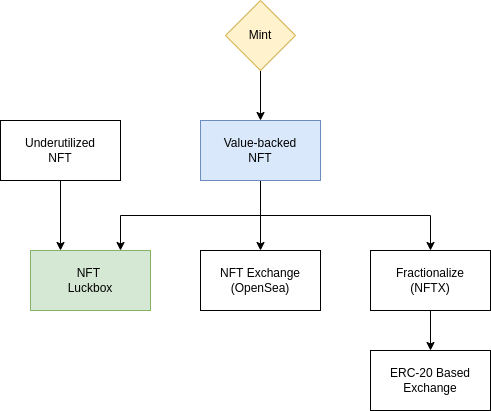

# Tamago Finance 🥚

In the virtual world, there are endless possibilities. People are changing their lives with NFTs, people are able to find work through play-to-earn games, artists are being appreciated, and there's just so much more. We are just at the tip of the iceberg. This is the metaverse. It is just getting started and is going to change the world.&#x20;

Tamago Finance is a platform with the ability to generate a financial asset in the form of ERC-1155 NFT on any EVM-compatible chain. The protocol can generate currencies, commodities, and digital assets to strengthen infrastructure facilities on NFT-centric environments and cross-chain NFT asset bridges. \
\
Tamago Finance is currently on Polygon, Ethereum Mainnet with following products/components:

* **Value-backed NFT** - An algorithmic synthetic asset that represents the specific amount of underlying asset such as USD, to mint NFT, offset fees and discount will be given dynamically from the bonding curve to help stabilize the value of collateral reserves against outstanding NFTs .
* **NFT Luckbox** - The first use case of value-backed NFTs. It is an NFT lottery embedded in our UI that allows anyone to create a "Luckbox" where creators can deposit a maximum of 9 NFTs. Players can draw from the LuckBox to try and win the NFTs that were deposited. &#x20;

\
Tamago Finance is at the early stage of development. If you have any questions or inquiry, please do not hesitate to contact us via Telegram or Discord.

