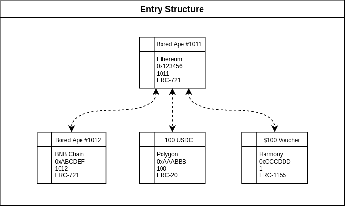

# Multi-chain Marketplace

## Introduction

Tamago multi-chain marketplace is a peer-to-peer (P2P) trading protocol fot NFT assets to be swapped across blockchain networks with safe and reliable, the seller can list any NFT into the system and accept the payment from any chain whether it's a NFT or fungible token.&#x20;

.png>)

The mechanism designed is simple and robust in structure, and facilities cross-chain swapping in an atomic manner protected by merkle hash tree generated during the time when the order entry is being created from the seller, therefore only the buyer who holds one of the assets determined by the buyer can actually swap it.

There are some of the use cases for Tamago multi-chain P2P marketplace:

* The creator uses for migrating the collection that already sold from one chain to another
* A trader from non-mainstream chain who seeks the liquidity from mainstream chain
* Distribution of the NFT collection in multi-chain ecosystem

The price-stable NFT can be accepted as the payment can be minted and redeemed openly by anyone (see "Value-backed NFT"), the NFT pegged to the value of multiple stablecoins with the allocation cap for each type to ensure the risk of de-pegging stablecoin is minimized.

## Networks

As of now the system is available on following networks:

* **Kovan (Testnet)**

## Mechanism

The marketplace employs a combination of off-chain and on-chain to reduce the storage capacity needed for listing and verification enables batch trading of NFT assets saves time and effort by treating multiple orders as one single transaction.&#x20;

By general, to sustain information sharing through a hybrid on-chain/off-chain architecture, the system utilizes the merkle tree as its core allows efficient and secure verification of the contents of large data structures. When the seller wants to sell their NFT, the order entry must be created and attached with the merkle tree object and its root that represents an array of individual assets accept in payment, a single leaf node of the merkle tree contains an EVM-based chain ID, contract address, token ID or amount (if it's ERC-20).

Transferring assets in and out of Ethereum mainnet usually facing long delays due to high gas prices that off-chain nodes can't afford frequent update the state root thus, processing time will vary depends on networks and the approximate times are as following:&#x20;

| Process              | Intra-chain | Cross-chain (Non-ETH to Non-ETH) | Cross-chain (Non-ETH to ETH) |
| -------------------- | ----------- | -------------------------------- | ---------------------------- |
| Create/Cancel Orders | Instantly   | 2-3 mins.                        | 10+ mins.                    |
| Swap Tokens          | Instantly   | 2-3 mins.                        | 10+ mins.                    |

When placing orders, the seller must submit an entry to IPFS storage where potential buyers can perform searches and find information about what are the requirements to claim the NFT asset listed by the seller, each entry is basically a JSON object contains a list of assets that willing to swap with.

### Intra-chain Swaps

Certain trading assets on the same chain do not require any off-chain nodes to be involved during the process from start to finish which is fully transparent, the seller can generates the 256-bit hash string that represents assets and properties they want to trade against and then upload to different order slot available on the smart contract, once the slot is occupied there will be only seller and eligible buyers who can cancel or fulfill orders.

 (3).png>)

### Cross-chain Swaps

When it come to cross-chain swaps, two types of off-chain nodes will be running and used in facilitating the transfers across networks.

* Relayer - The relayer helps creating and matching cross-chain orders, works as cluster and able to scale depends on the governance voting when it's available, serves as a single source of truth for sync all gateway contracts with the latest state root.
* Validator - The validator checks if the orders have been partially fulfilled by depositing of NFT/tokens at the destination chain as first come first serve, therefore the validator will authorize requests and allow a buyer to claim the asset at the origin chain and a seller at the destination chain.
